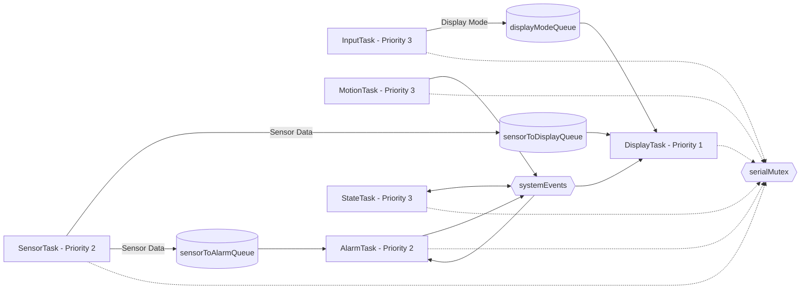

# FreeRTOS Architecture

## Overview

The RoomSense Monitor is implemented as a concurrent embedded system using multiple FreeRTOS tasks.

Each task has a specific responsibility, while queues, an event group, and a mutex are used to coordinate data and shared resources safely.

## Task Communication Diagram

## FreeRTOS Tasks

| Task | Main Responsibility | Priority |
|---|---|---:|
| SensorTask | Read DHT22 and LDR sensor data | 2 |
| DisplayTask | Control and update the OLED | 1 |
| InputTask | Process rotary encoder navigation | 3 |
| MotionTask | Monitor the PIR sensor | 3 |
| AlarmTask | Evaluate temperature conditions and control the buzzer | 2 |
| StateTask | Manage ACTIVE and INACTIVE operating states | 3 |

Higher priorities are assigned to tasks that require quicker response, such as motion detection, user input, and system-state handling.

The OLED display can tolerate more latency, so DisplayTask uses a lower priority.

## Sensor Queues

SensorTask produces environmental readings and sends them to other tasks through FreeRTOS queues.

### sensorToDisplayQueue

SensorTask sends sensor information to DisplayTask so that the OLED can show the most recent environmental readings.

### sensorToAlarmQueue

SensorTask also sends sensor information to AlarmTask so that temperature conditions can be evaluated independently.

## Display Mode Queue

InputTask processes the rotary encoder.

When the selected display page changes, the new display mode is sent to DisplayTask through displayModeQueue.

This keeps rotary encoder processing separate from OLED rendering.

## Event Group

The systemEvents event group represents important operating conditions in the system.

These include:

- ACTIVE state
- motion activity
- alarm condition
- PIR state

MotionTask, StateTask, AlarmTask, and DisplayTask use these event bits to communicate system status.

## Serial Mutex

Several FreeRTOS tasks may print diagnostic information through USART.

The serialMutex protects the serial output so that only one task writes at a time.

Without this protection, messages from different tasks could become mixed together.

## Blocking and Scheduling

Tasks do not continuously consume CPU time.

After performing their work, they either wait for data, wait for an event, or use a FreeRTOS delay.

This allows the scheduler to run other Ready tasks while waiting tasks remain Blocked.

## Periodic Sensor Execution

SensorTask performs environmental measurements periodically.

The task uses vTaskDelayUntil() to maintain a regular sampling period.

Unlike a simple delay after every execution, vTaskDelayUntil() bases the next execution on the previous scheduled wake time, helping reduce timing drift.

## Design Rationale

The firmware separates sensing, display control, user input, motion detection, alarm handling, and state management into independent tasks.

The main FreeRTOS mechanisms are:

| Mechanism | Purpose |
|---|---|
| Queue | Transfer sensor and navigation data |
| Event Group | Represent operating states and system events |
| Mutex | Protect shared serial output |
| Task Delay | Block tasks when immediate execution is unnecessary |
| vTaskDelayUntil() | Maintain periodic sensor execution |

This architecture allows the different parts of the RoomSense Monitor to operate independently while still communicating safely through FreeRTOS.