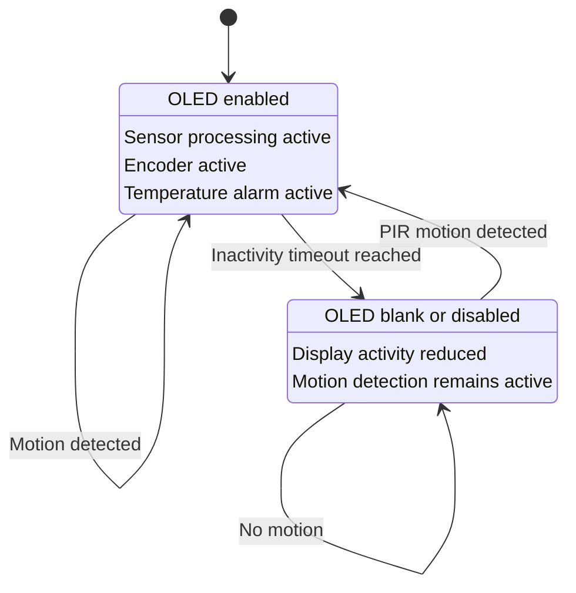

# System State Machine

## Overview

The RoomSense Monitor uses two main operating states:

- ACTIVE
- INACTIVE

The state machine reduces unnecessary display activity when the room has been inactive while keeping motion detection available so the system can wake again automatically.

## State Machine Diagram

## ACTIVE State

When the system is ACTIVE:

- the OLED is enabled
- environmental sensor information is processed normally
- the rotary encoder can change the displayed page
- temperature alarm monitoring remains active
- PIR motion continues to be monitored

Motion while already ACTIVE keeps the system in the ACTIVE state and refreshes the activity period.

## INACTIVE State

The system enters INACTIVE after the configured inactivity period expires without new motion.

While INACTIVE:

- the OLED is blanked or disabled
- unnecessary display activity is reduced
- PIR motion detection remains operational
- the system waits for new room activity

The motion subsystem must remain available because it is responsible for reactivating the system.

## Reactivation

When the PIR sensor detects motion while the system is INACTIVE, the state changes back to ACTIVE.

Normal display and user interaction then resume.

## Transition Summary

| Current State | Condition | Next State |
|---|---|---|
| ACTIVE | Motion detected | ACTIVE |
| ACTIVE | Inactivity timeout reached | INACTIVE |
| INACTIVE | No motion detected | INACTIVE |
| INACTIVE | Motion detected | ACTIVE |

## FreeRTOS Relationship

MotionTask monitors the PIR sensor and reports motion-related events.

StateTask uses this activity information to determine whether the application should remain ACTIVE or transition to INACTIVE.

The shared system event mechanism allows other tasks, such as DisplayTask and AlarmTask, to respond to the current operating state without duplicating the state-management logic.